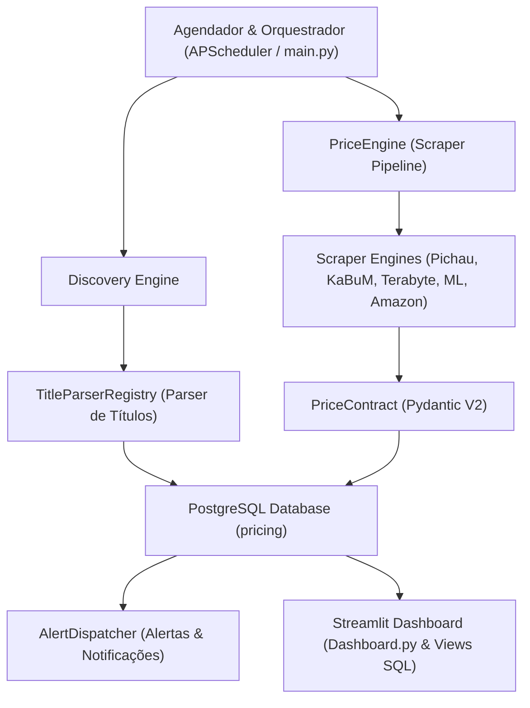
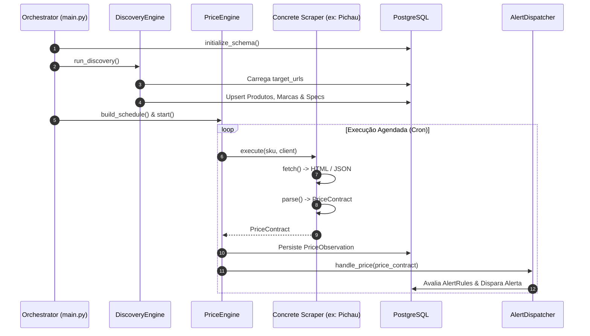

# Arquitetura do Sistema & Visão Geral 🏗️

O **GPU Price Tracker** é um sistema modular, resiliente e orientado a testes construído para automação da extração de preços, estruturação de catálogo e alertas de e-commerce.

---

## 1. Visão Geral da Arquitetura

O sistema é dividido em três camadas principais:

---

## 2. Ciclo de Vida da Execução (Sequence Diagram)

O diagrama abaixo ilustra o fluxo completo desde a inicialização do orquestrador até a atualização do banco e disparo de alertas:

---

## 3. Padrões de Projeto Aplicados

1. **Inversão de Controle & Injeção de Dependências (IoC):** O agendador `PriceEngine` e os scrapers nunca instanciam diretamente clientes HTTP ou contextos de navegador Playwright; eles recebem `ClientFactory` via injeção.
2. **Repository Pattern:** O acesso aos dados é encapsulado atrás de repositórios assíncronos (`PostgresPriceRepository`, `PostgresCatalogRepository`, `PostgresAlertRepository`).
3. **Registry Self-Registration (`@register_scraper`):** Cada scraper se auto-registra ao ser importado, eliminando a necessidade de modificar arquivos centrais para adicionar novas lojas.
