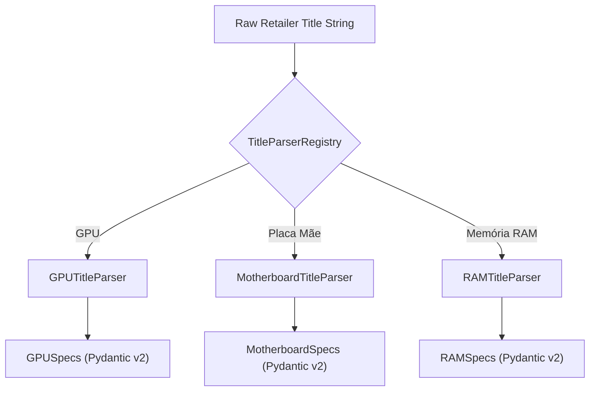

# Title Parsers & Externalização de Seletores 🔍

Esta documentação descreve os mecanismos de parsing determinístico de títulos e o versionamento dinâmico de seletores CSS.

---

## 1. TitleParserRegistry (`src/core/title_parser.py`)

O `TitleParserRegistry` é o componente responsável por receber uma string bruta de título enviada por um varejista (ex: Pichau, KaBuM!) e extrair atributos estruturados.

### Arquitetura dos Parsers Por Categoria



---

## 2. Seletores Externalizados em TOML (`data/selectors/`)

Nenhum scraper Python contém seletores CSS, XPath ou classes de elementos hardcoded. Todos os seletores vivem em arquivos `.toml` em `data/selectors/`.

### Exemplo de Configuração TOML (`data/selectors/pichau.toml`):

```toml
[v1]
title = "h1.product-title"
price_cash = "div.price-cash"
price_installments = "div.price-installments"
out_of_stock = "span.out-of-stock"

[v2]
# Caso a Pichau mude a interface, adicionamos v2 sem quebrar o código anterior!
title = "h1[data-testid='product-name']"
price_cash = "span[data-price='cash']"
```

---

## 3. Garantias de Determinismo

1. **Zero Network I/O no `parse()`:** O método `parse(document, sku)` aceita apenas a string HTML/JSON e retorna um modelo Pydantic `PriceContract` validado.
2. **Versionamento de Dados:** Cada observação salva no banco registra a versão do parser (`parser_version`) que a gerou.
