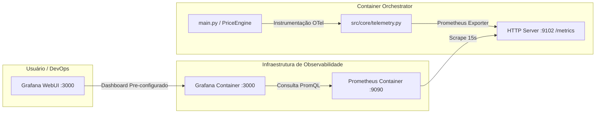

# Telemetria, Observabilidade & Monitoramento 📊

Este documento descreve a arquitetura de **Telemetria e Observabilidade Quantitativa** implementada no **GPU Price Tracker (`pricing-alert`)**.

A aplicação utiliza o **OpenTelemetry Python SDK** integrado a uma stack de observabilidade composta por **Prometheus** e **Grafana** via Docker Compose.

---

## 🏗️ Visão Geral da Arquitetura



---

## 📈 Catálogo Completo de Métricas

O módulo [`src/core/telemetry.py`](../../src/core/telemetry.py) expõe métricas padronizadas OpenTelemetry / Prometheus na porta `9102`:

### 1. Métricas de Scrapers & Desempenho

| Nome da Métrica | Tipo | Rótulos (Labels) | Descrição |
| :--- | :--- | :--- | :--- |
| `scraper_execution_duration_seconds` | `Histogram` | `store_name`, `status` | Tempo total de execução da raspagem de uma loja inteira. |
| `sku_processing_duration_seconds` | `Histogram` | `store_name`, `gpu_model`, `status` | Duração do ciclo individual de raspagem/parsing por SKU. |
| `ecommerce_http_latency_seconds` | `Histogram` | `store_name`, `transport_type`, `http_status` | Latência I/O de rede (Playwright Chromium vs HTTPX API). |

### 2. Métricas de Saúde & Erros de Seletores

| Nome da Métrica | Tipo | Rótulos (Labels) | Descrição |
| :--- | :--- | :--- | :--- |
| `selector_failures_total` | `Counter` | `store_name`, `selector_key`, `error_type` | Total de falhas de seletores CSS DOM (`SelectorOutdatedException`). |
| `sku_observations_saved_total` | `Counter` | `store_name`, `gpu_model`, `in_stock` | Total de preços extraídos com sucesso e salvos no PostgreSQL. |

### 3. Métricas de Alertas & Notificações

| Nome da Métrica | Tipo | Rótulos (Labels) | Descrição |
| :--- | :--- | :--- | :--- |
| `alert_evaluations_total` | `Counter` | `rule_type`, `triggered` | Quantidade de avaliações de regras de alertas efetuadas. |
| `alert_dispatches_total` | `Counter` | `channel`, `status` | Quantidade de notificações disparadas para canais (ex: Telegram). |
| `alert_dispatch_latency_seconds` | `Histogram` | `channel`, `status` | Tempo de envio de mensagem na API externa de notificação. |

---

## ⚙️ Opções de Configuração

As opções de telemetria podem ser ajustadas em `config.toml` por ambiente ou sobrescritas via variáveis de ambiente no `.env`:

### Em `config.toml`:

```toml
[production]
telemetry_enabled = true
metrics_port = 9102
telemetry_service_name = "gpu-pricing-orchestrator"
```

### Variáveis de Ambiente Suportadas (`.env`):

| Variável | Padrão | Descrição |
| :--- | :--- | :--- |
| `TELEMETRY_ENABLED` | `true` | Habilita/Desabilita a coleta e exportação de telemetria. |
| `METRICS_PORT` | `9102` | Porta TCP onde o endpoint `/metrics` é exposto no orchestrator. |
| `TELEMETRY_SERVICE_NAME` | `gpu-pricing-orchestrator` | Identificador da aplicação no Prometheus/Grafana. |

---

## 🖥️ Acesso às Ferramentas de Monitoramento

### 1. Prometheus WebUI
* **URL:** `http://localhost:9090`
* **Página de Alvos (Targets):** `http://localhost:9090/targets` (Deve exibir `orchestrator:9102` com status `UP`).
* **Arquivo de Configuração:** [`data/prometheus/prometheus.yml`](../../data/prometheus/prometheus.yml)

### 2. Grafana WebUI & Dashboards
* **URL:** `http://localhost:3000`
* **Credenciais Padrão:** 
  * **Usuário:** `admin`
  * **Senha:** `admin` *(Pode ser alterada no primeiro acesso ou ignorada clicando em "Skip")*
* **Datasource:** Pré-configurado automaticamente apontando para o Prometheus interno (`http://prometheus:9090`).
* **Dashboard Oficial:** **"GPU Scraper Health & Telemetry"** (id: `gpu_scraper_health`).
  * Provisionado automaticamente via [`data/grafana/dashboards/gpu_scraper_health.json`](../../data/grafana/dashboards/gpu_scraper_health.json).

---

## 📊 Painéis do Dashboard Grafana

O dashboard conta com 9 visuais analíticos de nível Enterprise:

1. **SLA / Taxa de Sucesso dos Scrapers (%):** Indicador tipo Gauge (Verde > 95%, Amarelo 85-95%, Vermelho < 85%) mostrando o percentual de raspagens concluídas com sucesso.
2. **E-Commerce Latência de Rede (p95 / p99):** Gráfico temporal comparando o tempo de resposta das requisições I/O em cada e-commerce.
3. **Tempo de Execução por Loja:** Medição média da duração das varreduras completas.
4. **Preços Coletados com Sucesso (Por Modelo & Por Loja):** Métricas agregadas da quantidade de GPUs capturadas e salvas no banco.
5. **Falhas de Raspagem (Por Modelo & Por Loja):** Métricas agregadas de erros agrupados por causa (`no_price`, `timeout`, `selector_outdated`, `store_unavailable`).
6. **Produtos Em Estoque vs Esgotados por Loja:** Gráfico de rosca (Pie chart) exibindo a taxa de disponibilidade das placas em cada e-commerce.
7. **Desempenho por Tipo de Transporte (Browser Stealth vs HTTP API):** Comparativo de latência p95 entre o Playwright Chromium e chamadas diretas REST.
8. **Falhas de Seletores DOM por Loja:** Gráfico de barras identificando quebras de layout ou drift de seletores CSS.
9. **Disparo de Alertas de Preço:** Status e volume de mensagens entregues via Telegram.

---

## 🔍 Exemplos de Consultas PromQL

### Taxa de Requisições de Rede por Loja (Req/min):
```promql
rate(ecommerce_http_latency_seconds_count[5m]) * 60
```

### Latência do Percentil 95 de Raspagem:
```promql
histogram_quantile(0.95, sum(rate(ecommerce_http_latency_seconds_bucket[5m])) by (le, store_name))
```

### Taxa de Sucesso dos Scrapers (%):
```promql
sum(rate(sku_observations_saved_total[1h])) / sum(rate(sku_processing_duration_seconds_count[1h])) * 100
```
