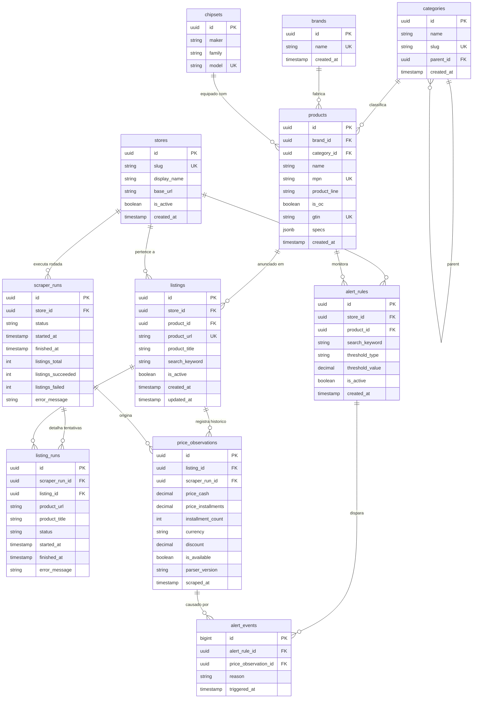

# Modelo de Dados & Diagramas ER (MER / DER) 🗄️

Esta documentação apresenta o **Modelo Entidade-Relacionamento (MER)** conceitual e o **Diagrama de Entidade-Relacionamento (DER)** físico da base de dados PostgreSQL do ecossistema **GPU Price Tracker**.

---

## 1. Modelo Entidade-Relacionamento (MER - Conceitual)

### Entidades e Definições

1. **Categoria (`categories`)**: Representa a classe genérica do produto no catálogo (ex: `GPU`, `Placa Mãe`, `Memória RAM`). Suporta hierarquia auto-referenciada (`parent_id`).
2. **Marca (`brands`)**: Fabricante ou marca parceira de montagem (ex: `ASUS`, `MSI`, `Gigabyte`, `Corsair`).
3. **Chipset (`chipsets`)**: Processador gráfico ou Soquete/Chipset lógico padronizado (ex: `RTX 5070 Ti`, `RX 7900 XT`, `AM5`, `B650`).
4. **Produto (`products`)**: O item de catálogo normalizado e unificado. Combina uma Marca, uma Categoria, um Modelo limpo, atributos fixos (`mpn`, `product_line`, `is_oc`) e atributos dinâmicos em `specs` (JSONB).
5. **Loja (`stores`)**: Varejista de e-commerce monitorado (ex: `Pichau`, `KaBuM!`, `Terabyte`, `Mercado Livre`, `Amazon`).
6. **Anúncio (`listings`)**: A oferta específica de um produto em uma loja, vinculada por uma URL única. Mantém o título bruto (`product_title`) como histórico de auditoria.
7. **Execução de Scraper (`scraper_runs`)**: Registro da rodada de scraping de uma loja em um momento no tempo.
8. **Execução de Anúncio (`listing_runs`)**: Telemetria individual da tentativa de extração de cada anúncio.
9. **Observação de Preço (`price_observations`)**: O registro temporal (histórico) do preço capturado (à vista, parcelado, desconto, disponibilidade).
10. **Regra de Alerta (`alert_rules`)**: Regras personalizadas de notificação atreladas a um produto ou termo de busca.
11. **Evento de Alerta (`alert_events`)**: Disparos de alerta gerados quando uma observação de preço atende aos critérios de uma regra.

---

## 2. Diagrama de Entidade-Relacionamento (DER - Físico)



---

## 3. Dicionário de Dados Completo

### Tabela `products`
| Coluna | Tipo | Restrições | Descrição |
| :--- | :--- | :--- | :--- |
| `id` | `UUID` | `PRIMARY KEY` | Identificador único global do produto. |
| `brand_id` | `UUID` | `NOT NULL, FK(brands.id)` | Marca/Fabricante (ex: Gigabyte, MSI). |
| `category_id` | `UUID` | `NOT NULL, FK(categories.id)` | Categoria (ex: GPU, Placa Mãe, RAM). |
| `name` | `TEXT` | `NOT NULL` | Nome limpo/modelo comercial do produto. |
| `mpn` | `TEXT` | `UNIQUE, NULLABLE` | Manufacturer Part Number (SKU da fábrica). |
| `product_line` | `TEXT` | `NULLABLE` | Linha de produto/sistema de refrigeração (ex: Windforce, TUF). |
| `is_oc` | `BOOLEAN` | `NOT NULL, DEFAULT false` | Indica se possui overclock de fábrica. |
| `gtin` | `TEXT` | `UNIQUE, NULLABLE` | Código EAN/UPC global do produto. |
| `specs` | `JSONB` | `NOT NULL, DEFAULT '{}'` | Atributos estendidos e indexados (GIN). |
| `created_at` | `TIMESTAMPTZ` | `NOT NULL` | Timestamp UTC da criação do registro. |

---

## 4. Schemas dos Atributos Dinâmicos (`specs` JSONB)

Os atributos específicos de cada categoria de hardware são armazenados de forma indexada no campo `specs` (JSONB):

### 🎮 Categoria: Placa de Vídeo (`GPUSpecs`)
```json
{
  "chipset": "RTX 5070 Ti",
  "chip_maker": "NVIDIA",
  "vram_gb": 16,
  "vram_type": "GDDR7",
  "is_oc": true,
  "form_factor": "SFF",
  "product_line": "Windforce",
  "mpn": "GV-N507TWF3OC-16GD",
  "features": ["DLSS", "Ray Tracing"]
}
```

### 📟 Categoria: Placa Mãe (`MotherboardSpecs`)
```json
{
  "socket": "AM5",
  "chipset": "B650M",
  "form_factor": "Micro-ATX",
  "memory_type": "DDR5",
  "memory_slots": 4,
  "max_memory_gb": 192,
  "product_line": "TUF Gaming"
}
```

### ⚡ Categoria: Memória RAM (`RAMSpecs`)
```json
{
  "capacity_gb": 32,
  "module_count": 2,
  "memory_type": "DDR5",
  "speed_mhz": 6000,
  "latency_cl": "CL30",
  "has_rgb": true,
  "product_line": "Vengeance"
}
```
