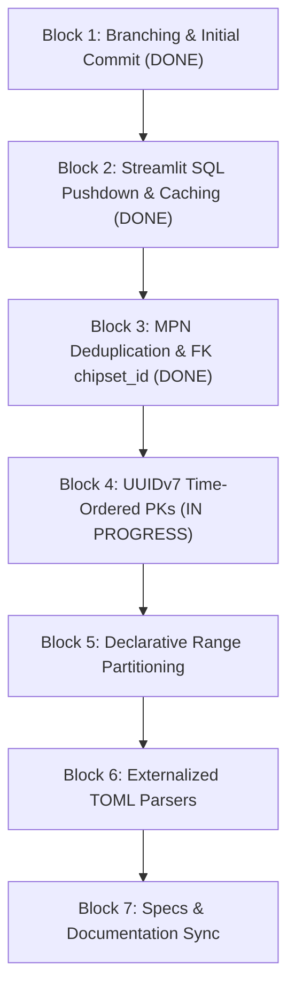

# Technical Implementation Plan: Hardware Catalog Expansion & Performance Hardening

**Initiative Slug**: `hardware-catalog-expansion`  
**Branch Strategy**: `refactor/db-architecture-performance-hardening` (branched from `develop`)

---

## Technical Approach & File Changes

---

## File-Level Map

| Block | File | Action | Purpose |
| :--- | :--- | :--- | :--- |
| **1** | `git` branch | `git checkout -b` | Isolate work on `refactor/db-architecture-performance-hardening` |
| **2** | `src/ui/Dashboard.py` | `MODIFY` | Add `@st.cache_data(ttl=300)` and SQL time pushdown filter |
| **3** | `src/db/schema.py` | `MODIFY` | Add `chipset_id UUID REFERENCES chipsets(id)` to `products` |
| **3** | `src/core/catalog.py` | `MODIFY` | Add `chipset_id`, `mpn`, `product_line`, `is_oc` to `Produto` |
| **4** | `src/core/utils.py` | `MODIFY` | Implement `uuid7()` generator (RFC 9562) |
| **4** | `src/core/contract.py` | `MODIFY` | Adopt `uuid7()` for `PriceContract.execution_id` |
| **5** | `src/db/schema.py` | `MODIFY` | Add `PARTITION BY RANGE (scraped_at)` DDL and partition helper |
| **6** | `data/parsers/*.toml` | `NEW` | Externalized TOML parsing rules per hardware category |
| **6** | `src/core/title_parser.py` | `MODIFY` | Load TOML parsing rules dynamically |
| **7** | `specs/` & `docs/` | `MODIFY` | Synchronize DER/MER, data contracts, and README specs |

---

## Verification Steps

1. **Unit Tests:** Run `pytest tests/unit/test_title_parser.py` and `pytest tests/unit/test_postgres_catalog_repository.py`.
2. **PostgreSQL Verification:** Query `information_schema.columns` and `vw_dashboard_products` in `pricing_db`.
3. **Git History:** Verify 7 atomic commits using Conventional Commit messages (`feat:`, `perf:`, `refactor:`, `docs:`).
